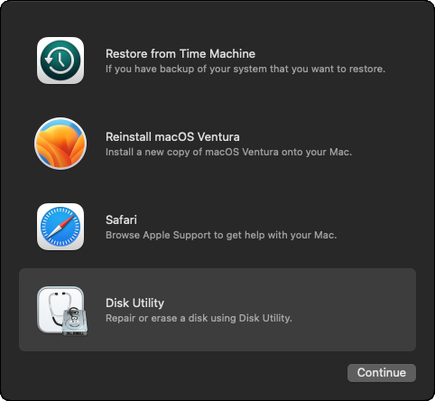
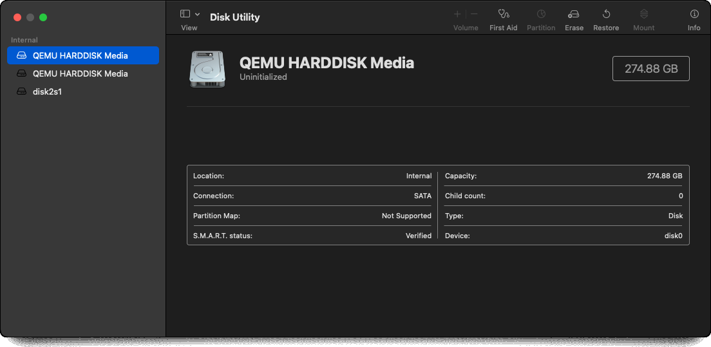
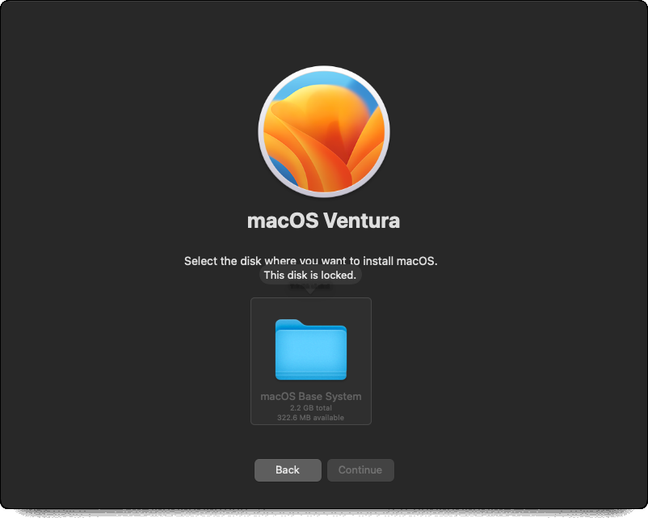

Docker macOS container
======================

The project that makes this possible is <https://github.com/sickcodes/Docker-OSX>

However, it's instructions are very unclear.

Assuming, you've already got Docker set up, find the latest macOS version listed in the Docker-OSX [`README`](https://github.com/sickcodes/Docker-OSX/blob/master/README.md).

At this time, it was Ventura - run the `docker run` command shown for this version.

```
$ docker run -it \
    --device /dev/kvm \
    -p 50922:10022 \
    -v /tmp/.X11-unix:/tmp/.X11-unix \
    -e "DISPLAY=${DISPLAY:-:0.0}" \
    -e GENERATE_UNIQUE=true \
    -e MASTER_PLIST_URL='https://raw.githubusercontent.com/sickcodes/osx-serial-generator/master/config-custom.plist' \
    sickcodes/docker-osx:ventura
```

Eventually, a window will pop up where you have two clickable options - _macOS Base System_ or _UEFI Shell_.

Select _macOS Base System_ (just press return or wait - it'll eventually automatically select this option).

You'll see a lot of old style log output as the system boots into the macOS _Recovery_ application.



Select the _Disk Utility_ option and press _Continue_. You then get to a screen like this:



When I did this, the bottom _disk2s1_ was selected by default but you want to select the largest disk - in my case this was the top one with 274.88GB.

Click _Erase_ and choose a name you'll remember for when you have to select it later in the setup process.

Once this has succeeded (it's fairly quick), close the _Disk Utility_ and this time select _Reinstall macOS Ventura_ and _Continue_.

This time you'll go through a normal macOS installation. If it tells you "This disk is locked" then you skipped the _Disk Utility_ step - you should see two drives and you need to select the one you erased and named earlier.



As part of the process, it'll ask you to enter your Apple ID or create a new one.

As Apple have been fairly snippy about the whole macOS virtualization process in the past, I created a new ID rather than associate this virtualized setup with my existing Apple ID.

Once the process is completed, you need to create a new image that captures the fully installed macOS state - if you simply exit and rerun the `docker run` command above you'll just end up going through the whole process again.

So before you exit, run `docker ps` and find out the _container ID_ for the container you've just set up:

```
$ docker ps
CONTAINER ID   IMAGE                          COMMAND                  CREATED             STATUS             PORTS                                           NAMES
adc0d381b03f   sickcodes/docker-osx:ventura   "/bin/bash -c 'sudo …"   About an hour ago   Up About an hour   0.0.0.0:50922->10022/tcp, :::50922->10022/tcp   distracted_jennings
^^^^^^^^^^^^
```

Now, commit that ID as a new image, you need to give the image a name, I simply changed the `sickcodes` part of the original name to `installed`:

```
$ docker commit adc0d381b03f installed/docker-osx:ventura
sha256:b85db4665cce9d50bdf8cb10702f3dcef916254470a05d6000835f14f5b29297
```

This will pause the container and persist it as a new image. On my machine, this took about 2 minutes with no indication of progress until it completed and printed out the `sha256` value corresponding to the image.

You can then start this image as above, just replace `sickcodes/docker-osx:ventura` with the name you chose, e.g. `installed/docker-osx:ventura`.

Restarting such an image takes a noticeable amount of time with no initial signs of progress - if you run `htop`, you'll see that running `touch` on some of the files involved _seems_ to be what's taking all the time and CPU but I'm not sure why `touch` would take a long time (and what its purpose is in this situation).

Performance
-----------

By default, the system is given a tiny 4GB of memory and almost no cores. The whole thing runs very slowly with the default arguments even on a fairly beefy machine. I believe it's using x86-64 versions of the OS rather than Apple silicon ones (Apple is still releasing x86-64 versions) but despite that there's e.g. noticeable key-press delays running this on my Intel Linux box.

The `README` suggests trying e.g. `-e EXTRA='-smp 8,sockets=4,cores=2'`, I did this and it did seem to improve things.

Note that using `-e EXTRA=...` isn't telling Docker to use more cores, `-e` is for passing an environment variable to the container. So, something in this container picks up `EXTRA` and the specified arguments turn out to be QEMU arguments (see `-smp` covered in the [QEMU `man` page](https://www.qemu.org/docs/master/system/qemu-manpage.html)).

I didn't investigate this enough and didn't look into how this is different to e.g. using the `docker run --cpus` argument. And I didn't look into increasing the available memory.

Going further
-------------

The `README` covers many more possibilities - changing resolution, using existing disks etc.

The same thing for Windows
--------------------------

If you want to do something similar with Windows, i.e. run Windows using Docker, then see <https://github.com/dockur/windows> - this has a much clearer `README` (and associated how-to video).

Image size
----------

The images created by `docker commit` are very large - about 35GB each.

I quickly ran out of space creating such images - I found out what was taking up all the space with:

```
$ sudo ncdu
```

`sudo` is needed as the things taking up all the space are under `/var/lib/docker` which isn't generally readable.

In the end, I just nuked everything with:

```
$ sudo docker system prune --all
```

There's probably a much more sensible way to do things that would have preserved e.g. the last created image but my system was in a state where most things I did resulted in it complaining there was no space left to complete the given action.
