Connecting up the J-Link EDU Mini
=================================

TLDR; ...

If there's a good getting started guide to simply connecting up the J-Link EDU Mini to a dev board for the first time, I haven't found it.

When you buy a J-Link EDU Mini, you get the debugger itself, a USB cable, 10-pin cable (often called an SWD cable) and a 20-pin cable (often called a JTAG cable).

Note: even if one cable is _commonly_ called an SWD cable and the other a JTAG cable, both can actually be used for either SWD or JTAG.

Most ARM Cortex dev boards use SWD debugging so let's focus of the 10-pin cable. The first obvious question is which way to connect the cable to the J-Link? You've got four options, only two of which are valid:

<table>
  <tr>
    <td>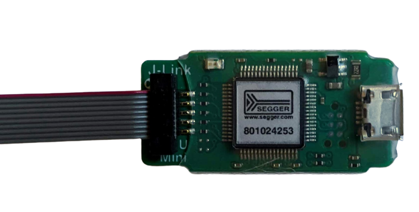</td><td>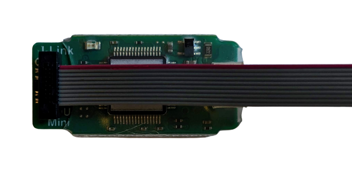</td>
  </tr>
  <tr>
    <td>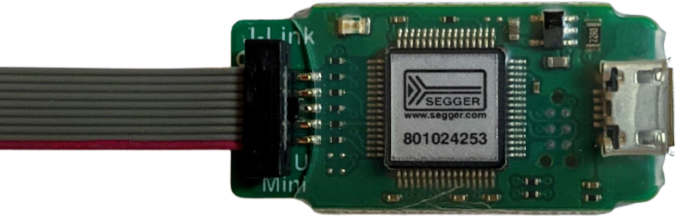</td><td>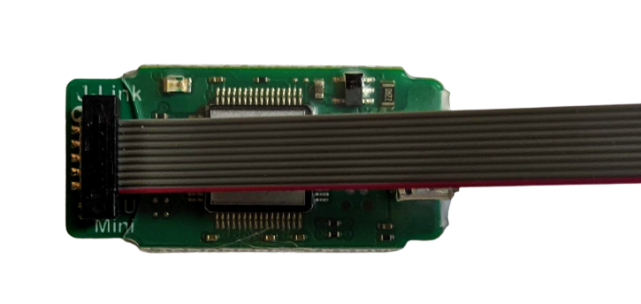</td>
  </tr>
</table>

The two valid options are the ones where red wire is at top, i.e. the red wire of the cable should be just below the "J-Link" that you see top-left on the debugger. The only page I found that mentioned the red wire, and where it should be, was this [one](https://wspublishing.net/articles/j-link-edu-mini-metro-m0-express/) from wspublishing.net but once you know what the pins are for (see below) it's easy enough to verify this using a multimeter in continuity mode.

Then connecting the other end to your dev board is easy _if_ it has an SWD header like this:

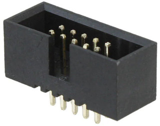

The notch on the cable's connector means that there's only one way round you can plug it into this.

However, many boards don't have an SWD header like this. Instead, you have to search for the relevant SWD pins, among all the other pins available around the edge of the board, or for a group of 5x2 pins somewhere else on the board.

So what pins are you looking for? You'll make things much easier for yourself if you buy a breakout like [this one from Adafruit](https://www.adafruit.com/product/2743) for the end of the SWD cable that is not plugged into the J-Link itself:

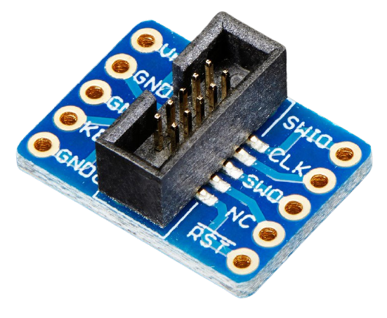

If we look at the names of the pins on this breakout, we see Vref, GND, GND, KEY, GNDd on one side and SWIO, CLK, SWO, NC (not connected) and RST on the other.

Note: SWIO is more often written as SWDIO (and sometimes as DIO) and CLK is generally written as SWCLK.

We can line that up with the pinout shown on the J-Link EDU Mini [product page](https://www.segger.com/products/debug-probes/j-link/models/j-link-edu-mini/):

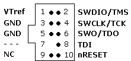

In this diagram, we can see that two of the pins aren't connected at all, i.e. the ones corresponding to KEY and GNDd on the breakout above.

KEY is expected to not be present - on some SWD headers that pin is actually removed to help with orienting things (i.e. you know the missing pin should be the second one up from the bottom left). And GNDd is just a pin that the J-Link EDU Mini doesn't bother with - GNDd is short for GNDDetect and it's a rather mysterious pin that seems to be rarely, if ever, used even on more expensive debuggers that support this pin. About the only documentation for it is [here](https://developer.arm.com/documentation/ddi0314/h/serial-wire-debug-and-jtag-trace-connector/signal-definitions) where ARM describe it as "can be used by target system for debugger presence detection." but in practice it seems debuggers use the Vref pin for this.

On the Segger pinout above we see a pin called TDI and three pins with the names TMS, TCK and TDO. These are the names for the pins when working with [JTAG](https://en.wikipedia.org/wiki/JTAG#Electrical_characteristics). But as we're working with SWD, we're not interested in TDI (it's a pure JTAG pin) and we're only interested in the SWD names of the other three pins, i.e. SWDIO, SWCLK and SWO.

So looking at our breakout about again, we're basically left with GND and five other relevant pins - Vref, SWDIO, SWCLK, SWO and RST. Things now get even easier - it turns out that only GND, SWDIO and SWCLK really have to be connected up for an [SWD](https://wiki.segger.com/SWD) connection.

So what are the other pins and why _might_ you connect them:

* Vref can be connected to the regulated voltage output of your dev board (often labelled 3V3). Connecting this pin allows the debugger to detect when the board is powered up and gives it a reference voltage against which it can determing if the SWDIO or SWCLK pins are high (usually, such a reference isn't required but apparently with some boards it can be an issue).
* SWO is an optional output pin that isn't a core part of SWD but which you can use to output your own debug specific messages, i.e. you can pepper your code with printf-like statements, configured to write to the SWO pin, and this data can be read and output e.g. by your IDE during a debugging session. For more on SWO, see e.g. this [tutorial from AdAstra](https://adastra-soft.com/poor-man-arm-cortex-m-swo/) or this [one from @McuOnEclipse](https://mcuoneclipse.com/2016/10/17/tutorial-using-single-wire-output-swo-with-arm-cortex-m-and-eclipse/).
* RST allows the debugger to trigger hard resets of the MCU on the dev board. Depending on how the board is set up this may be necessary (e.g. typical Chinese black-pill boards) but often it is not.

So generally you end up with a setup like this:

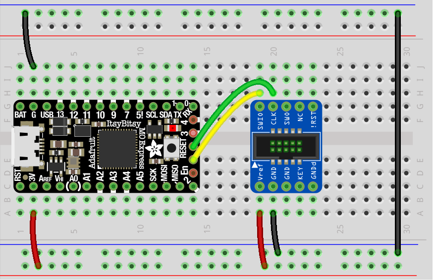

Don't be confused - the "RESET" on the board is the label for the board's push button and not the label for the pin that the green wire is connected to.

So here SWDIO, SWCLK are connected along with GND and Vref (an noted, connecting Vref may not strictly be necessary).

The board above is an Adafruit [ItsyBitsy M0 Express](https://www.adafruit.com/product/3727), you'll need to find the location of the relevant pins on your particular board. The ItsyBitsy also has a RST pin (bottom left) but SWO is not made available as a pin so on this particular board you can't connect to SWO even it you want to.

Note: the picture above comes from [this Adafruit article](https://learn.adafruit.com/how-to-program-samd-bootloaders?view=all) on using a J-Link to flash a bootloader onto a SAMD board.

Here's an example (from [here](https://wiki.segger.com/Black_Pill) on the Segger wiki) of a board where RST has to be connected up (in addition to GND, Vref, SWDIO and SWCLK):

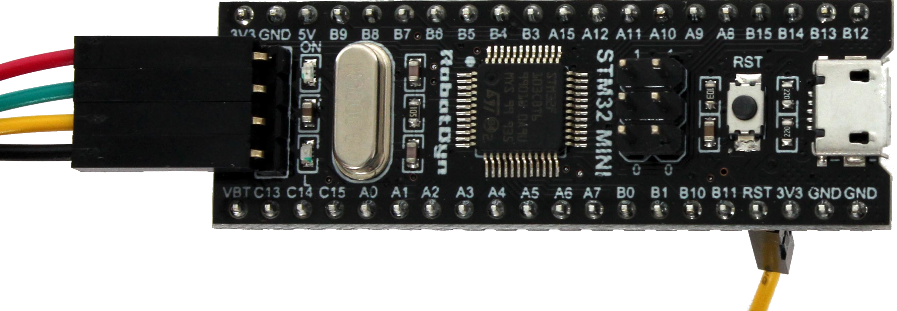

3V3, SWDIO, SWCLK and GND are connected to on the left-hand side and RST is the pin bottom-right connected to with a yellow wire.

Installing J-Link software and documentation
--------------------------------------------

The J-Link software and documentation comes in one big bundle (it doesn't seem to be possible to download individual components).

So go to the [Downloads page](https://www.segger.com/downloads/jlink/#J-LinkSoftwareAndDocumentationPack), then to the _J-Link Software and Documentation Pack_ section and then download and install the pack appropriate for your system.

I installed the 64-bit `.deb` bundle, suitable for Ubuntu, like so:

```
$ mv ~/Downloads/JLink_Linux_V694b_x86_64.deb /tmp
$ cd /tmp
$ sudo apt install ./JLink_Linux_V694b_x86_64.deb 
```

Aside: moving things into `/tmp` just avoids `apt` issues over who owns the containing directory (the user who downloaded the `.deb` file or the root user running `apt install`).

You can see what's been installed like so:

```
$ dpkg-query -L jlink
```

We're interested in the commands that end up in `/usr/bin`:

```
$ ls -l /usr/bin/JLink*
0 lrwxrwxrwx 1 root root 38 Jan 26 18:08 /usr/bin/JLinkConfig -> /opt/SEGGER/JLink_V694b/JLinkConfigExe
0 lrwxrwxrwx 1 root root 38 Jan 26 18:08 /usr/bin/JLinkConfigExe -> /opt/SEGGER/JLink_V694b/JLinkConfigExe
0 lrwxrwxrwx 1 root root 32 Jan 26 18:08 /usr/bin/JLinkExe -> /opt/SEGGER/JLink_V694b/JLinkExe
0 lrwxrwxrwx 1 root root 41 Jan 26 18:08 /usr/bin/JLinkGDBServerExe -> /opt/SEGGER/JLink_V694b/JLinkGDBServerExe
...
```

As you can see the names are all very Windows like. Most of the commands are soft-linked such that you can call them with or without `Exe` at the end, e.g. `JLinkConfig` and `JLinkConfigExe`. Oddly, this isn't the case for `JLinkExe` which is the first command we're going to use.

Note: as part of the installation the file `/etc/udev/rules.d/99-jlink.rules` is installed. Among other things, it configures things such that anyone can access the J-Link device without having to use `sudo`.

Upgrading the J-Link Mini
-------------------------

Before we connect the debugger to a development board, let's first check that we can access the debugger and, in the process, update it to the latest firmware release. We can do this with the `JLinkExe` command:

```
$ JLinkExe 
SEGGER J-Link Commander V6.94b (Compiled Jan 26 2021 18:05:49)
DLL version V6.94b, compiled Jan 26 2021 18:05:34

Connecting to J-Link via USB...Updating firmware:  J-Link EDU Mini V1 compiled Jan  4 2021 16:18:35
Replacing firmware: J-Link EDU Mini V1 compiled Oct 22 2019 16:28:45
Waiting for new firmware to boot
New firmware booted successfully
O.K.
Firmware: J-Link EDU Mini V1 compiled Jan  4 2021 16:18:35
Hardware version: V1.00
S/N: 801024253
License(s): FlashBP, GDB
VTref=0.000V


Type "connect" to establish a target connection, '?' for help
J-Link>
```

When `JLinkExe` connects to the debugger, it first checks its firmware and if there's a newer version, it asks you if you want to update. Oddly, despite being a command-line tool, it does this with a GUI dialog:

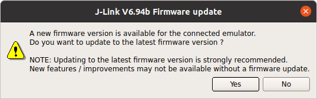

In the `JLinkExe` output above, you can see it updated the firmware on my debugger from the version compiled on "Oct 22 2019" to one compiled on "Jan 4 2021".

It also reminds you that J-Link EDU Mini can only be used for non-commerical purposes:

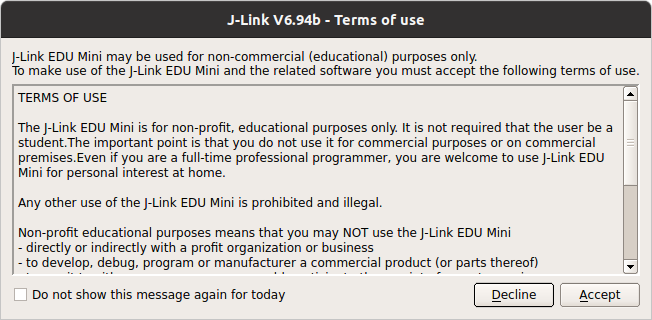

Once you're at the `J-Link>` prompt, you're ready to connect to a target, i.e. your dev board.

Note: the usual way to exit from many shell-like application is with ctrl-D. However, if I try that with `JLinkExe`, it coredumps - just enter `q` to quit instead.

Connecting to your dev board
----------------------------

Quit out of `JLinkExe` is you're still running it. Note the line from the output above that shows the `VTref` voltage:

```
VTref=0.000V
```

This shows that the debugger can't detect any voltage on its Vref pin. Let's disconnect the debugger and wire things up such that it can detect a voltage and can connect the target.

Wire things up as shown in the diagram up above - choosing the appropriate 3v3, GND, SWDIO and SWCLK pins on your development board.

TODO: include photos of breadboard setup.

Once you've double-checked all the wiring, power the dev board and plug in the debugger.

Note: more expensive debuggers can also power the target device, the J-Link EDU Mini cannot - so the target needs its own power source (generally a USB connection).

Now run `JLinkExe` and you should see something like this:

```
$ JLinkExe 
SEGGER J-Link Commander V6.94b (Compiled Jan 26 2021 18:05:49)
...
VTref=3.295V

Type "connect" to establish a target connection, '?' for help
J-Link>
```

Now, we can see that `VTref` is almost exactly 3.3V. Let's try and connect:

```
J-Link>connect
Please specify device / core. <Default>: Unspecified
Type '?' for selection dialog
Device>
```

If you enter `?` then it pops up this dialog. You need to know what kind of MCU your board has, e.g. an STM32F722ZE or whatever. My board has an ATSAMD51G19A, if I start typing ATSAMD51 in the device filter field, I can see that the nearest it has is "ATSAMD51G19" (why they've dropped the final "A", I don't know - there aren't any other variants, e.g. ones that end with "B", "C" or whatever). So that's what I select.

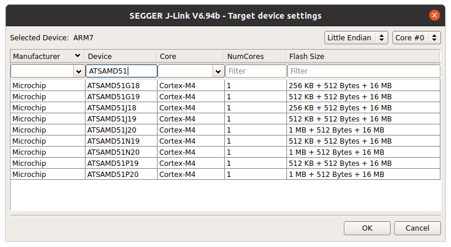

Then it asks for the target interface:

```
Please specify target interface:
  J) JTAG (Default)
  S) SWD
  T) cJTAG
TIF>
```

Enter `S` as we're using SWD. Then it asks for the speed, just press _Enter_ to accept the default:

```
Specify target interface speed [kHz]. <Default>: 4000 kHz
Speed>
```

That's it, now, if all goes well, it'll connect to the target and extract and display various bits of information about it:

```
Connecting to target via SWD
...
AP[0]: AHB-AP ROM base: 0x41003000
CPUID register: 0x410FC241. Implementer code: 0x41 (ARM)
Found Cortex-M4 r0p1, Little endian.
FPUnit: 6 code (BP) slots and 2 literal slots
CoreSight components:
ROMTbl[0] @ 41003000
ROMTbl[0][0]: E00FF000, CID: B105100D, PID: 000BB4C4 ROM Table
ROMTbl[1] @ E00FF000
ROMTbl[1][0]: E000E000, CID: B105E00D, PID: 000BB00C SCS-M7
ROMTbl[1][1]: E0001000, CID: B105E00D, PID: 003BB002 DWT
ROMTbl[1][2]: E0002000, CID: B105E00D, PID: 002BB003 FPB
ROMTbl[1][3]: E0000000, CID: B105E00D, PID: 003BB001 ITM
ROMTbl[1][4]: E0040000, CID: B105900D, PID: 000BB9A1 TPIU
ROMTbl[1][5]: E0041000, CID: B105900D, PID: 000BB925 ETM
ROMTbl[1][6]: E0042000, CID: B105900D, PID: 003BB907 ETB
Cortex-M4 identified.
J-Link>
```

Note: `JLinkExe` remembers the device you selected, e.g. "ATSAMD51G19", for next time (on Linux it stores this information in `~/.config/SEGGER/JLinkDLL.ini`).

That's it - your computer, your J-Link EDU Mini and your dev board are all connected up and talking to each other. Enter `?` for a long list of commands you can enter at the `J-Link>` prompt. But actually, you're next step will probably be to get the debugger working with GDB and your IDE.

Notes
-----

For more on the JTAG and SWD pins on a 10-pin connector, see this [page from Keil](https://www.keil.com/support/man/docs/ulinkplus/ulinkplus_jtagswd_interface.htm) and for more on the JTAG and SWD pins on a 20-pin connector see the [page from Segger](https://www.segger.com/products/debug-probes/j-link/technology/interface-description/) (as you can see for the 20-pin connector one side is all GND pins so you've actually only got a few real additonal pins over those found on the 10-pin connector).
