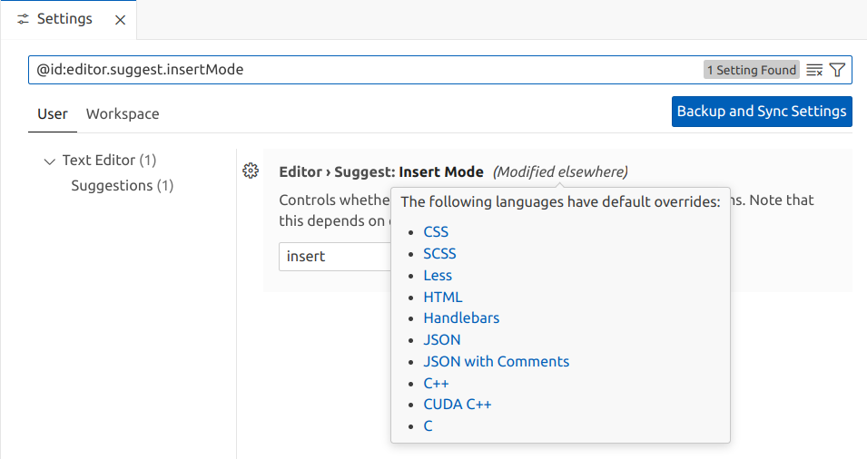
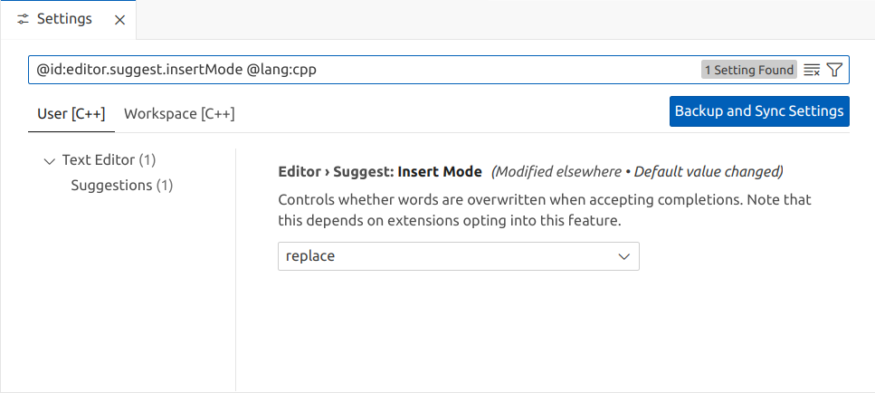

VS Code auto-complete insert or replace
=======================================

VS Code started annoying me by replacing the text to the right of my cursor whenever I accepted an auto-complete suggestion.

I don't believe this was always the behavior - perhaps I somehow accidentally enabled it or it was changed by VS Code or an extension.

This [SO answer](https://stackoverflow.com/a/75450931/245602) pointed me at the solution which I'll rehash here.

Go to _File_ / _Preferences_ / _Settings_ and search for `@id:editor.suggest.insertMode`, it shows "insert", i.e. the behavior I want, but also shows _(Modified elsewhere)_, if you hover over this it shows something like this:

In my case C++ was the language where I was experiencing this issue. So, clicking this lanuage (or just searching for `@lang:cpp @id:editor.suggest.insertMode`) gets you to:

Just change this from "replace" to "insert" and all is good (there's no save button for settings - the change takes effect immediatelly).
